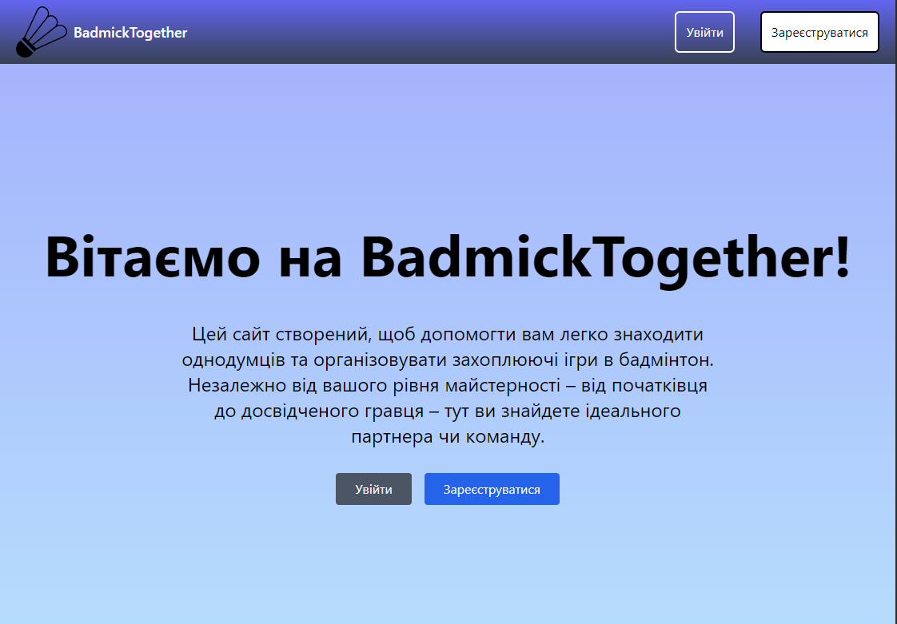
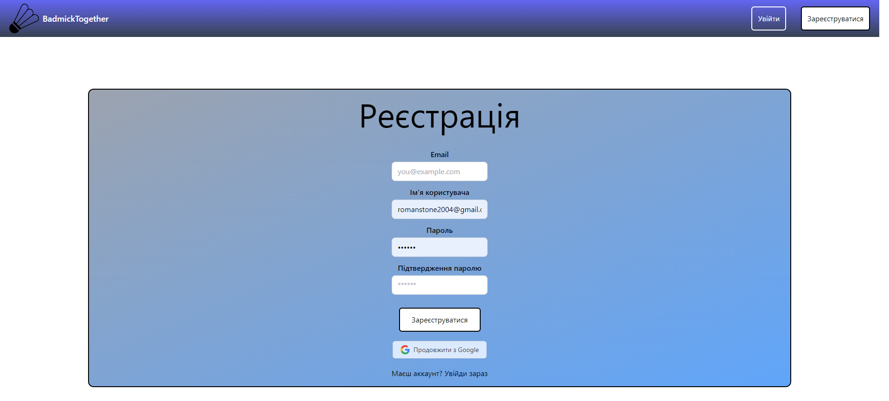
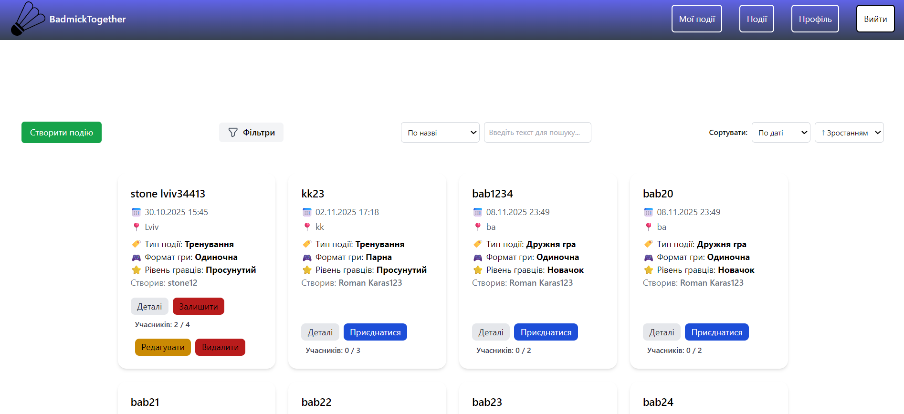
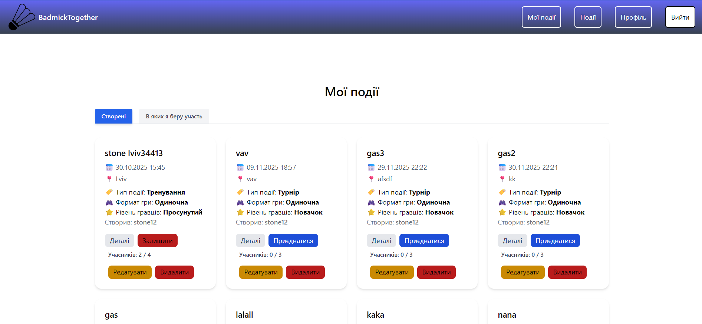
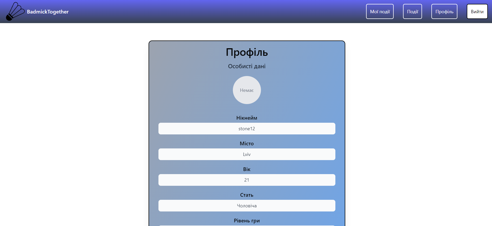

# BadmickTogether

A web application for managing events with a clear client‑server separation. Built as a single‑page application (SPA) with a modern frontend, containerized development environment, and tooling configured for a smooth developer workflow.

---

## Project Overview

**BadmickTogether** enables users to create, edit, filter, and browse events. The repository contains a React frontend and a backend API responsible for authentication and data handling. The project includes Docker configuration for local deployment and development tooling such as ESLint and TypeScript configuration files.

---

## Key Features

- **User authentication** via OAuth and handling of authorization responses.  
- **Event CRUD** — create, read, update, delete events.  
- **Event filtering and search** by multiple criteria.   
- **Client‑server architecture** with REST API endpoints.  
- **Docker and docker‑compose** for easy local environment setup.

---

## Technology Stack

- **Frontend:** React, RTKQuery, Vite, TailwindCSS
- **Frontend:** Express.js, PostgreSQL, Sequelize ORM
- **Languages:** JavaScript, TypeScript  
- **Tooling:** ESLint, tsconfig
- **Containerization:** Docker, docker‑compose

---

## API collection
- https://documenter.getpostman.com/view/10560412/2sB3dPR9gW
  
---

## UI

### Home Page


### SignUp Page


### Events Page


### MyEvents Page


### Profile Page


---

## Quick Start

### Clone the repository
```bash
git clone https://github.com/RomanPie2020/BadmickTogether.git
cd BadmickTogether
```

## Run locally without Docker
### Client
```bash
cd client
npm install
npm run dev
```

### Server
```bash
cd ../server
npm install
```

### Run database migrations
```bash
npx sequelize-cli db:migrate
```

### (Optional) Seed initial data
```bash
npx sequelize-cli db:seed:all
```

### Start server
```bash
npm run dev
```

## Run with Docker
```bash
docker-compose up --build
```

---

## Environment Configuration

- Add OAuth credentials and other secrets to environment variables for both client and server.  
- Provide database connection details and any API keys via `.env` or your preferred secret management.  
- Consider adding a `.env.example` file listing required variables.

---

## Repository Structure

- **client** — React + RTKQuery + Vite frontend: UI components, routes, forms, Tailwind styles.  
- **server** — Backend API: authentication logic and data handling.  
- **docker-compose.yml** — Compose configuration to run services in containers.  
- Configuration files: `tailwind.config.js`, `tsconfig.json`, `.eslintrc`, etc.

---

## Recommendations for Improvement

- Add a detailed `.env.example` and documentation for required environment variables.  
- Implement unit and integration tests for critical components and API endpoints.  
- Configure CI to run linting and tests on pull requests.  

---

## Contributing

- Open an issue to discuss new features or bugs.  
- Submit pull requests with a clear description of changes and tests where applicable.  
- Follow existing code style and linting rules.

---

## Contact

For questions or help with the codebase, open an issue or submit a pull request in the repository.
